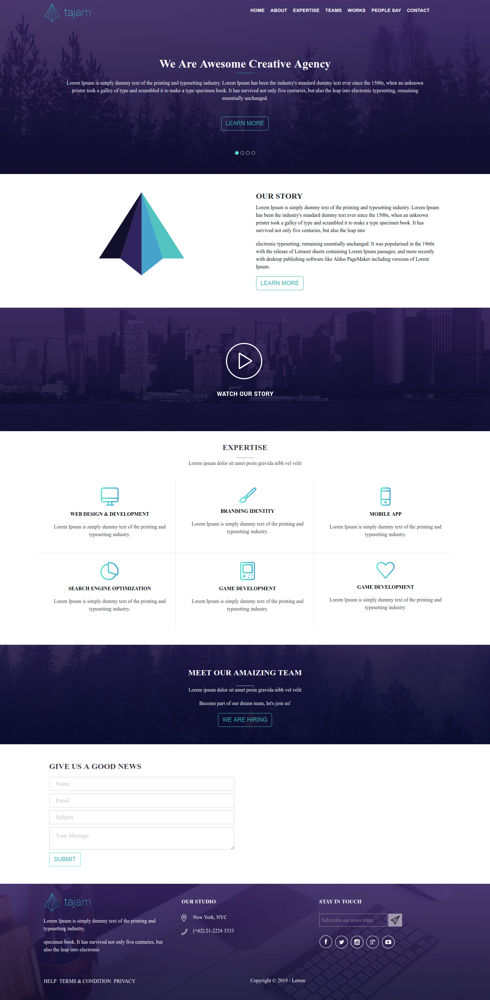

# GatsBy Website Example

This repository contains an example with gatsby framework and demonstrate a really good structured code. Uniqueness of this example is styling which
esseintaly 90% of styling is based on latest version of bootstrap which is Bootstrap 4 version.

## Installation

Use the package manager [npm](https://nodejs.org/en/download/) to install Gatsby Website Example.

Install necessary dependencies:
```bash
npm install 
```
Run application:

```bash
npm start
```
## Example



## License
[MIT](https://choosealicense.com/licenses/mit/)
